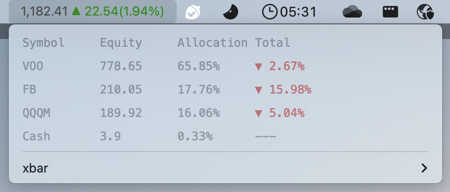

# Robinhood plugin for xbar
This plugin provides the easiest way to access your portfolio value and held positions.


## How to use it
* Download the latest release of [xbar](https://github.com/matryer/xbar#get-started).
* Install [robin-stocks](https://github.com/jmfernandes/robin_stocks) package.
  ```
  $ pip install robin_stocks
  ```
* Clone this repo and move file to plugin folder of xbar.
  ```
  $ git clone https://github.com/xingyu-long/robinhood_plugin_for_xbar.git
  $ chmod 755 robinhood.1m.py # In case xbar cannot run it.
  ```
